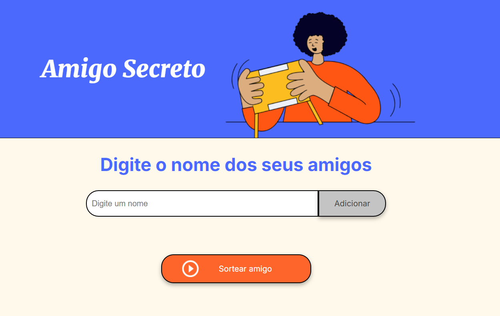
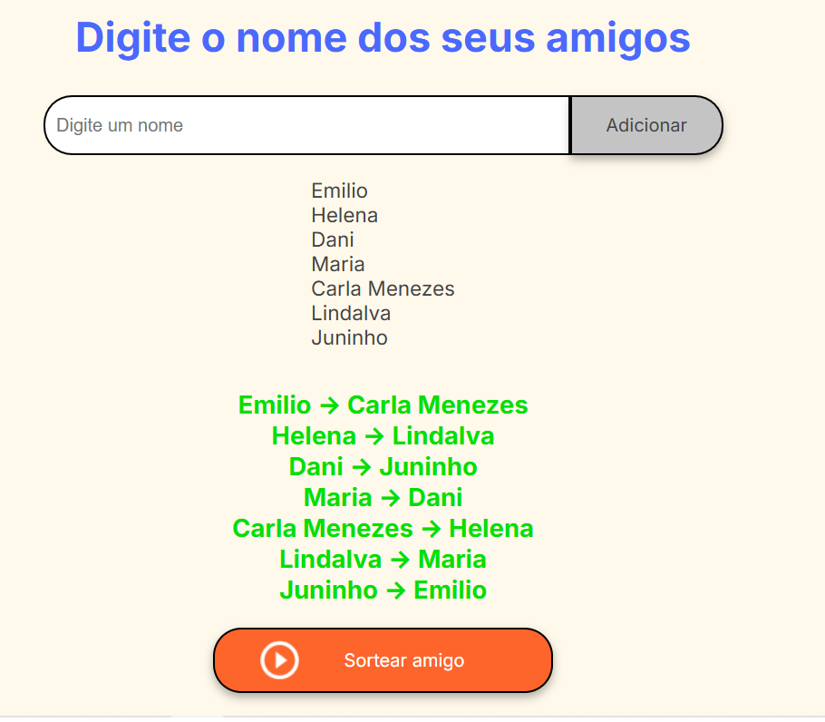

# 🎉 **Amigo Secreto**

  
*Imagem representativa do jogo de Amigo Secreto.*

## Badges

  


---

## Índice

1. [Descrição do Projeto](#descrição-do-projeto)
2. [Status do Projeto](#status-do-projeto)
3. [Funcionalidades](#funcionalidades)
4. [Demonstração](#demonstração)
5. [Tecnologias Utilizadas](#tecnologias-utilizadas)
6. [Como Acessar](#como-acessar)
7. [Pessoas Contribuidoras](#pessoas-contribuidoras)
8. [Pessoas Desenvolvedoras do Projeto](#pessoas-desenvolvedoras-do-projeto)
9. [Licença](#licença)

---

## Descrição do Projeto

Este é um jogo simples de **Amigo Secreto**, onde você pode adicionar os nomes dos participantes, realizar o sorteio automaticamente e visualizar quem é o amigo secreto de cada pessoa. O projeto foi desenvolvido utilizando **JavaScript** para a lógica de sorteio e **CSS** para a estilização da interface. O objetivo é proporcionar uma maneira prática e divertida de organizar o tradicional jogo de amigo secreto.

---

## Status do Projeto

- [x] Em andamento
- [ ] Concluído
- [ ] Em fase de testes

---

## Funcionalidades

- **Adicionar Amigos**: Permite adicionar os nomes dos participantes.
- **Exibir Lista de Amigos**: Mostra os nomes dos amigos adicionados.
- **Sortear Amigo Secreto**: Realiza o sorteio aleatório garantindo que ninguém se sorteie para si mesmo.
- **Exibir Resultado**: Mostra quem tirou quem na lista de resultados.
- **Design Responsivo**: Funciona bem em dispositivos móveis e desktops.

---

## Demonstração

Veja abaixo como a aplicação funciona:

### Adicionando Amigos

Na tela inicial, você pode digitar os nomes dos amigos que irão participar do sorteio. Após digitar o nome, basta clicar no botão **Adicionar** para incluí-lo na lista.


### Realizando o Sorteio

Depois de adicionar pelo menos dois amigos, você pode clicar no botão **Sortear amigo** para gerar os pares de amigos secretos. O sorteio é feito de forma aleatória e ninguém pode tirar a si mesmo.



---

## Tecnologias Utilizadas

- **JavaScript**: Para a lógica de adição de amigos e sorteio.
- **CSS**: Para o estilo e responsividade da página.
- **HTML**: Estrutura da página e interação com o usuário.
- **Fonts**: Utilização das fontes **Inter** e **Merriweather**.

---

## Como Acessar

### Pré-requisitos

1. Navegador moderno (Chrome, Firefox, Edge, etc.)
2. Clone o repositório:
   ```bash
   git clone https://github.com/zucajunior/amigo_secreto
   ```

### Executando o Projeto

1. Navegue até o diretório do projeto:
   ```bash
   cd amigo-secreto
   ```
2. Abra o arquivo `index.html` no seu navegador.

A aplicação será carregada diretamente no navegador, e você poderá começar a adicionar nomes e realizar o sorteio!

---

## Pessoas Contribuidoras

Agradecemos às seguintes pessoas que ajudaram neste projeto:

- **Emilio Junior**: Descrição da contribuição.
- **Curso Alura**: Descrição da contribuição.

---

## Pessoas Desenvolvedoras do Projeto

- **Zuca**: Desenvolvedor Principal

---

